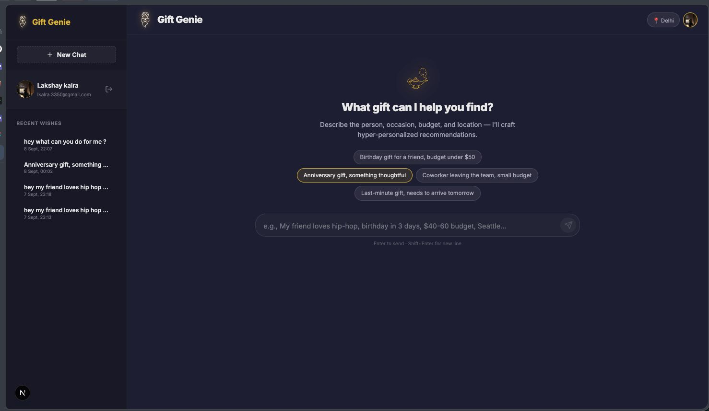
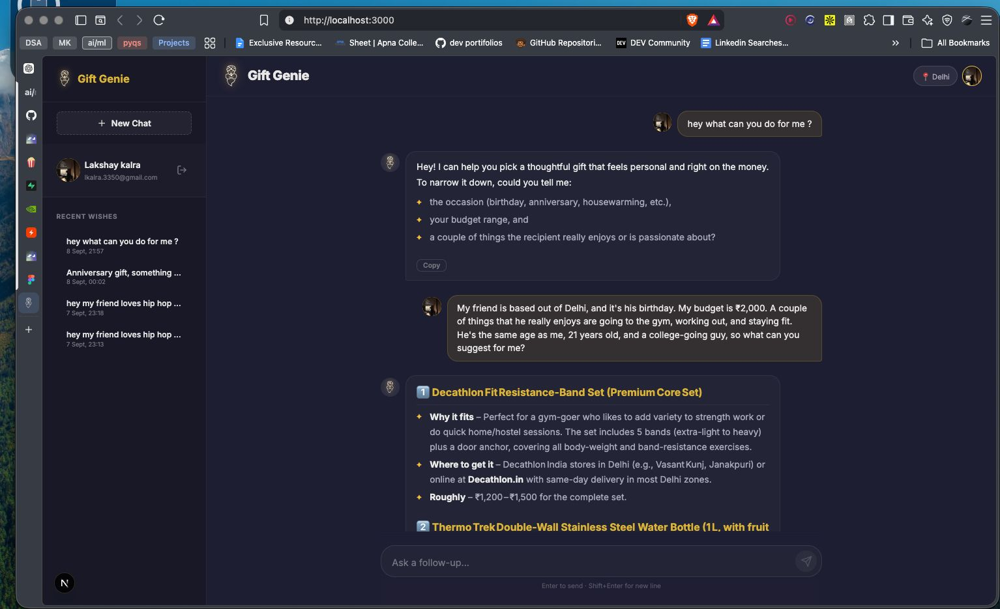

# 🧞 Gift Genie

**Gift Genie** turns the hardest shopping question — *"what do I get them?"* — into a two-minute conversation. Tell it who the gift is for, and it asks the one question that actually matters (occasion, budget, taste), then streams back three thoughtful, well-reasoned picks with real prices, real stores, and a reason each one fits — grounded in a live web search, not guesswork.

---

## What it does

You land on a clean prompt, not a form — a headline question, a few tappable starters ("Birthday gift for a friend, budget under $50", "Last-minute gift, needs to arrive tomorrow"), and your location already picked up in the header so pricing is right from the first message.

<p align="center">
  
</p>

Type what you actually know — even just "my friend loves hip-hop" — and Gift Genie asks back the one question that unlocks a good answer: occasion, budget, what the person's into. No ten-field form, no guessing. Once it has enough, it streams back numbered picks in real time, each with **why it fits**, **where to get it**, and a **realistic price range** — not a generic list, an argument for that specific gift. Say "cheaper" or "more personal" and it revises those same picks instead of starting the conversation over.

<p align="center">
  
</p>

Sign in with Google and every wish list is saved to your account, browsable from the sidebar the next time you're stuck for an idea. Skip it and Gift Genie still works end-to-end in guest mode, with history kept locally in your browser instead.

Under the hood, every recommendation is checked against a live web search before it reaches you, so what you get back are real products from real retailers rather than an invented brand or a link that goes nowhere.

**Coming next**
- **Clickable source citations** — surface the exact search results behind a recommendation as chips under each answer, so you can verify a pick without leaving the chat.
- **Direct "buy now" links** — turn a recommendation straight into a purchase with a retailer deep link, instead of a name you have to search for yourself.

---

## Engineering

**Stack**

| Layer | Choice |
|---|---|
| Framework | Next.js (App Router, React 19) |
| Language | TypeScript |
| AI | Google Gemini via Vercel AI SDK, with search grounding (`google_search` tool) |
| AI fallback | Groq, swapped in automatically when the Gemini free quota is exhausted |
| Auth & DB | Supabase (Postgres + Auth, Row Level Security) |
| Validation | Zod |
| Styling | Vanilla CSS |

**Design**

- **Streaming-first API** — `/api/gift` is a single route handler built on `streamText` + `toUIMessageStreamResponse`, so tokens (and the search sources behind them) reach the client as the model produces them instead of buffering a full response.
- **Provider fallback, not provider lock-in** — `lib/ai.ts` centralizes model selection behind one env flag (`AI_PROVIDER`), so swapping the underlying LLM is a config change, not a code change.
- **Dual-mode persistence** — `lib/db.ts` and `lib/auth.ts` transparently switch between Supabase (when configured) and `localStorage` (when not), so the app runs zero-config out of the box and upgrades to a real backend without touching UI code.
- **Server-owned prompt logic** — Location and conversation context are folded into the system prompt server-side (`buildSystemInstructions`) rather than trusting the client, keeping currency/locale rules and safety constraints (no invented products, no fake URLs) in one place.
- **Fail-soft by default** — Location detection, streaming errors, and auth all degrade gracefully (e.g. a failed IP lookup or a 429 from the model surfaces a plain message instead of breaking the chat).

---

## Getting started

```bash
npm install
cp .env.example .env.local   # add your keys
npm run dev
```

No keys? It still runs — Gift Genie falls back to guest auth and local storage automatically. See [.env.example](.env.example) for the full list of variables.
