<div align="center">


# PopStream

**Find a film the way you'd describe it to a friend. Watch free classics right in the app. The home screen learns what you like.**

Next.js 16 · Supabase pgvector · Gemini · LangGraph

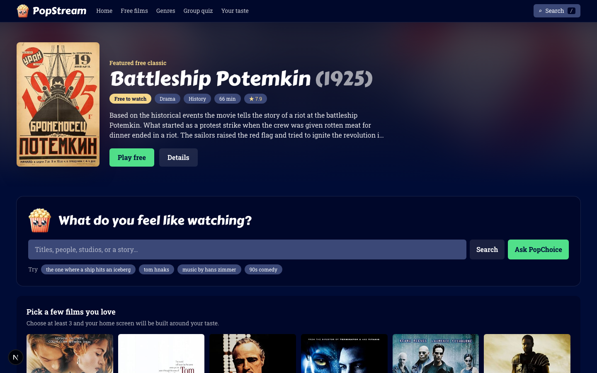

</div>

PopStream is a small streaming app over a catalogue of 100 films (25 of them free to watch). It also includes **PopChoice**, a group quiz that picks one film for everyone. It's a prototype built to run entirely on free tiers, and it doubles as a working example of retrieval-augmented generation (RAG), hybrid search and content-based personalisation.

---

## What you can do

### 1. Search the way you think

One search box takes titles, people, studios, half-remembered plots and plain-words filters.

| You type | What happens |
| --- | --- |
| `the one where a ship hits an iceberg` | Finds films by **meaning**. Titanic comes first, with the plot line that matched. |
| `tom hnaks` (typo) | Autocomplete offers Tom Hanks. Results say "Showing results for Tom Hanks" and list only his films. |
| `music by hans zimmer`, `pixar` | Matches crew and studios. Tags read "Music by Hans Zimmer" or "From Pixar". |
| `90s comedy under 2 hours` | Turns the words into removable chips (`1990s` `Under 2 hours` `Comedy`), then filters. |

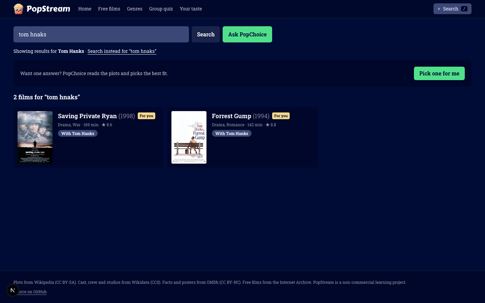

Every result says **why it matched**: a credit ("With Tom Hanks"), a plot line ("Story match"), a critic's line ("Critics say"), or "Matches the mood" when only the meaning matched. Vague memories work too:

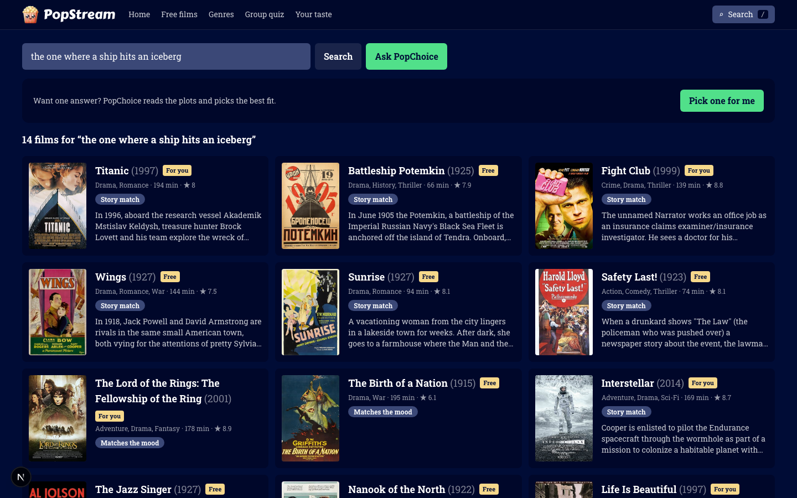

### 2. Ask PopChoice for one answer

Can't decide? **Ask PopChoice** reads the plots and gives one pick with a written reason, then offers *Play free*, *Details* or *Another pick*. It only runs when you press the button, because it uses AI credits.

<!-- TODO: uncomment when public/pics/ask-pick.png shows a real written reason (see docs/screenshots-todo.md)
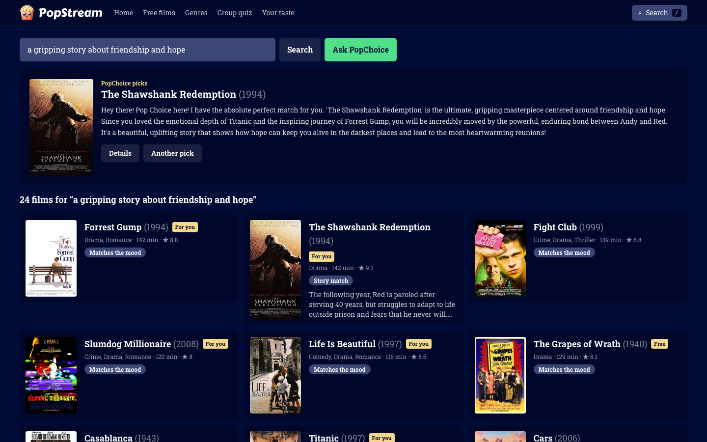
-->

### 3. A home screen that learns your taste

There are no accounts. On your first visit you pick a few films you love. The home page then rebuilds itself around them, with **Top picks for you**, **Because you watched…**, **Recently watched** and **Because you searched…**. Liking, disliking or playing a film keeps tuning it.

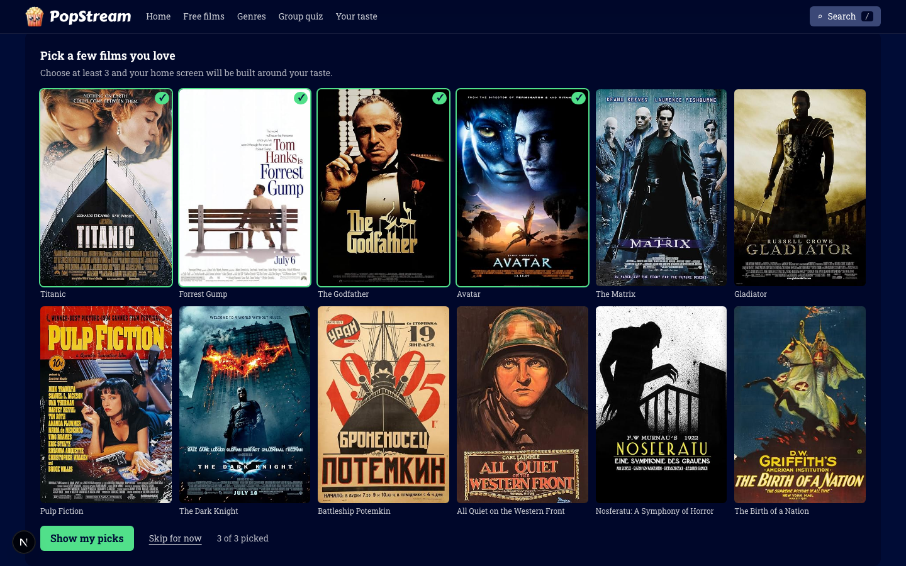

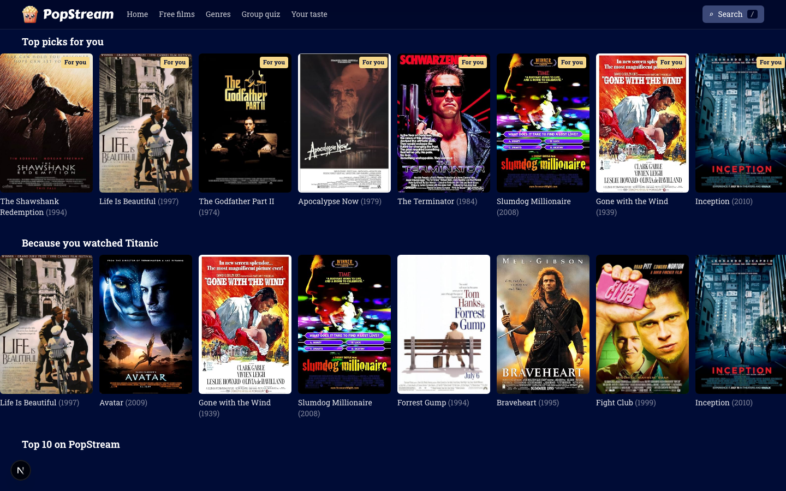

### 4. Title pages, and free films you can play

Each title page shows the cast and crew (every name links to their other films), awards, genres and topics, and *More like this*. Free films play right in the app from the Internet Archive.

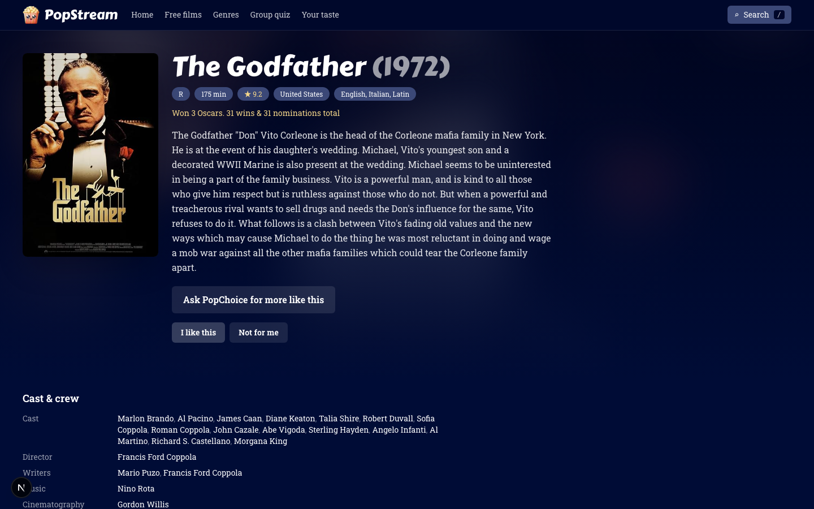

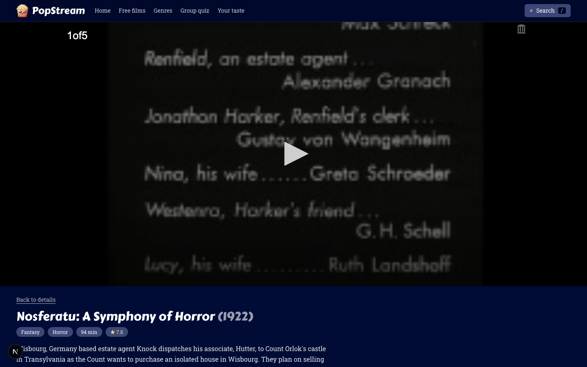

### 5. You control your data

**Your taste** shows everything the app remembers. You can remove a liked film, or press **Clear my history** to wipe it.

<!-- TODO: uncomment when public/pics/you.png shows the Your taste page (see docs/screenshots-todo.md)
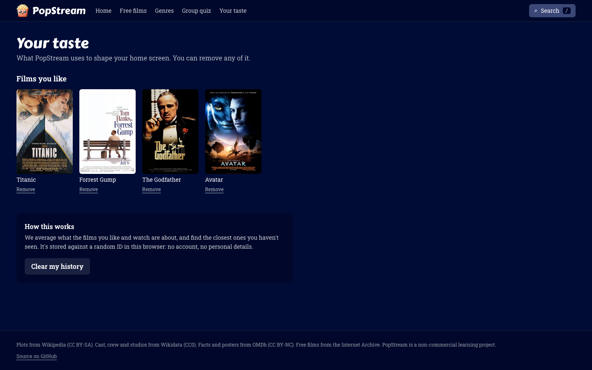
-->

### 6. Group quiz

Movie night with friends? PopChoice asks how many people are watching and how much time you have, collects each person's answers, and picks one film for the group. It lives at `/popchoice`, links back to PopStream, and is designed as a phone-sized flow.

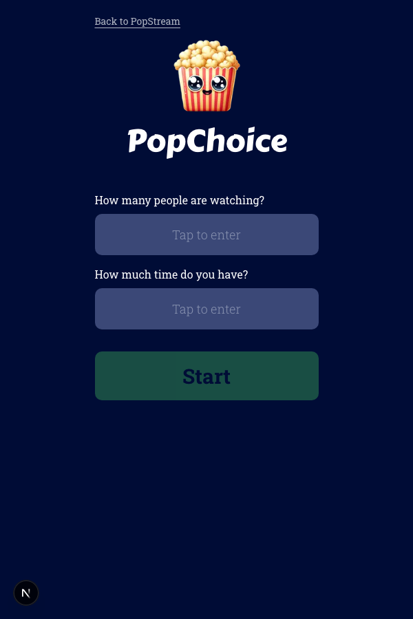

PopStream also works on a phone. The header collapses and a bottom tab bar (Home, Search, Quiz, You) takes over:

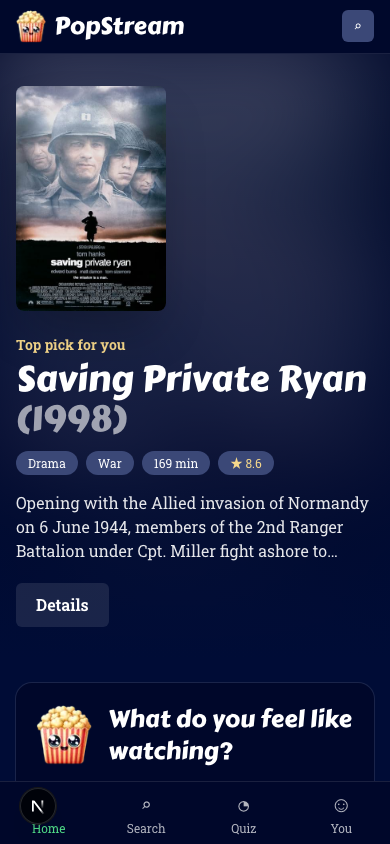

---

## How search, AI and streaming connect

```
 what you type
      │
      ├─► filter parser        "90s comedy under 2 hours" → chips + filters        (src/lib/query.ts)
      ├─► did-you-mean         trigram match on people/studios/titles              (suggest() in SQL)
      │
      ▼
 hybrid_search()  in Postgres
      ├─ vector arm    Gemini embedding of your text vs. plot/reception/profile chunks   (meaning)
      ├─ keyword arm   full-text search, including the cast/crew "facts" chunk           (names)
      └─ taste arm     re-ranks only the candidates already found, by your taste vector  (you)
              │            all three merged with Reciprocal Rank Fusion
              ▼
 results, each with a "why it matched" tag ─────────────► title page ─► watch page

 Ask PopChoice (LangGraph):  plan → retrieve → grade ─ good ─► pick one, with a reason
                                        ▲               │
                                        └── revise ◄────┘ (bad results: relax filters or rewrite; max 2 loops)
```

---

## Engineering

### Data pipeline (`scripts/pipeline`, `npm run pipeline`)

Extract → transform → load, resumable and cached in `data/raw/`.

| Source | What it provides |
| --- | --- |
| Wikidata | The catalogue, plus cast, crew, studios and topics (SPARQL) |
| Wikipedia | Plot and reception text |
| OMDb | Facts, ratings, awards, posters |
| Internet Archive | A check that a free copy really exists, has video, and is public domain |

Loads are **idempotent**: each chunk has a content hash, and only changed chunks are re-embedded. The whole cast-and-crew enrichment cost **0 new embeddings and 0 new OMDb calls**.

### Chunking and the "facts" chunk

Each film becomes several chunks: a *profile* (metadata plus a short plot), *plot* chunks and *reception* chunks. These are embedded (768-dim Gemini vectors) and searched by meaning. A last *facts* chunk ("Starring…, Directed by…, Music by…, Produced by…, Awards…") is **keyword-only, with no embedding**. Names are matched exactly and stories are matched by meaning, which keeps the split clean and the cost at zero.

### Hybrid search and Reciprocal Rank Fusion

`hybrid_search()` runs a vector search (pgvector, HNSW) and a full-text search (GIN) and merges the two rankings with RRF: each list contributes `1 / (60 + rank)`. Nothing has to compare a cosine distance with a text score. A film that ranks well in either list, or in both, floats up.

### Typo-tolerant names

`pg_trgm` (trigram similarity) powers autocomplete and "did you mean". `word_similarity` lets both `hanks` and `tom hnaks` find Tom Hanks.

### Taste profile (content-based filtering)

Your ID is a random UUID in an httpOnly cookie. The **taste vector** is the average of the profile embeddings of films you liked or played (the latest 30), minus half the average of films you disliked. *Top picks* are the nearest films you haven't seen. Personalisation only **re-orders relevant results** (a half-weight third RRF list) and never injects irrelevant ones. **Cold start** is handled by the onboarding picker. "People like you also watched" (collaborative filtering) was deliberately skipped: it needs many real users.

### Corrective RAG (`src/lib/recommend.ts`)

| Node | Job |
| --- | --- |
| `planQuery` | Turns the request into a semantic query, names and filters (structured output, constrained to real genres) |
| `retrieveMovies` | Runs `hybrid_search` |
| `gradeResults` | A small model judges whether any candidate really fits |
| `reviseQuery` | If not, rewrites the query or relaxes the weakest filter first |
| `pickMovie` | A larger model picks one film and explains why, using only the retrieved films |

### Reliability

- **Grounding guard:** the model can only choose a film that retrieval returned.
- **Fallbacks:** if planning, grading or picking fails, the app uses the raw prompt, accepts the results, or returns the top candidate with a generic line. It never returns a blank page.
- **Bounded loop:** at most 2 corrections.
- **Caching:** raw API responses on disk, content hashes for embeddings, and a 30-day cache for "where to watch".

### Privacy and security

- No accounts and no personal data. One random ID per browser, deleted with **Clear my history**.
- `viewer_events` has row-level security on **with no policies**, so only the server's service-role key can touch it. That key never reaches the browser.
- Catalogue tables are public-read. `/api/events` validates every input with zod.
- Free films are streamed only when the Internet Archive item is playable **and** either carries a public-domain licence or dates from 1930 or earlier.

### Free-tier engineering

| Service | Limit | How the app copes |
| --- | --- | --- |
| Gemini embeddings | 100 requests/min, plus a daily cap | Facts chunks aren't embedded. Set `EMBED_DELAY_MS=65000` for big loads. |
| Gemini generation | Free-tier quota per model | AI runs only on **Ask PopChoice**. Override the models with `MODEL_FAST` and `MODEL_SMART`. |
| OMDb | 1,000 requests/day | Responses are cached; a re-run costs nothing. |
| Watchmode (optional) | 2,500 calls/month | Hidden unless `WATCHMODE_API_KEY` is set. |

Cost per action: plain search = 1 embedding. Home, name, genre and taste pages = SQL only. Ask PopChoice ≈ 4–7 model calls.

### Known limits

- **Catalogue:** 100 films, so some searches (for example "man stranded on an island") have no great match.
- **Free tier:** Ask PopChoice can fall back to a generic description when the free quota runs out.
- **Rate limits:** `/api/events` has no rate limit yet (marked with a `ponytail:` note in the code).

---

## Tech stack

Next.js 16 (App Router, Turbopack) · React 19 · Tailwind CSS 4 · Supabase Postgres with pgvector and pg_trgm · Vercel AI SDK with Google Gemini · LangGraph · zod · Node's built-in test runner.

## Project structure

```
src/
  app/
    (stream)/              PopStream: home, /search, /title/[id], /watch/[id], /name/[name], /genre/[name], /you
      _components/         AskForm (combobox), SearchDialog, PosterRow, Onboarding, PopChoicePick, ...
    popchoice/             the group quiz
    api/
      chat/                Ask PopChoice (LangGraph)
      suggest/             autocomplete
      events/              likes, plays, searches, clear history
  lib/
    recommend.ts           the LangGraph corrective-RAG graph
    search.ts              filters + did-you-mean + hybrid retrieval + "why" tags
    query.ts               plain-words filter parser (pure, tested)
    movies.ts              data access
    viewer.ts              anonymous taste profile
    watchmode.ts           optional "where to watch"
scripts/pipeline/          extract, transform, load (+ tests)
supabase/migrations/       001 … 006 (006 is the current search and taste schema)
docs/                      notes, including the screenshot to-do
```

## Run it locally

```bash
npm install
cp .env.example .env.local        # add your Supabase, Gemini, OMDb keys and CONTACT
```

1. Run `supabase/migrations/*.sql` in order (the last, `006`, is the current schema).
2. Load the data: `npm run pipeline -- all --limit 100`.
3. `npm run dev`, then open http://localhost:3000.

| Command | What it does |
| --- | --- |
| `npm run dev` / `build` / `start` | Next.js |
| `npm run lint` | ESLint |
| `npm test` | Pipeline transform tests and the query-parser tests |

`CONTACT` (an email or URL) is required by the pipeline: Wikimedia asks every API client to identify itself.

## Glossary

- **RAG (retrieval-augmented generation):** look up relevant text first, then let a language model answer using only that text.
- **Embedding:** a list of numbers that captures the meaning of a text, so similar texts are close together.
- **pgvector:** a Postgres extension for storing and searching embeddings.
- **HNSW:** a fast approximate index for nearest-neighbour vector search.
- **Full-text search:** keyword search with stemming, backed by a GIN index.
- **Trigram:** three-letter slices of a word. Comparing them makes typo-tolerant matching possible.
- **RRF (Reciprocal Rank Fusion):** merges several ranked lists by summing `1 / (60 + rank)`.
- **LangGraph:** a library for building an LLM workflow as a graph of steps, with loops.
- **Structured output:** making the model return data that fits a schema, not free text.
- **Content-based filtering:** recommending things similar to what you liked, judged by their content.
- **Taste vector:** the average embedding of what you like.
- **Cold start:** having nothing to personalise from on the first visit.
- **ETL:** extract, transform, load: the data pipeline.
- **Idempotency:** running something twice gives the same result as running it once.

## Data and licensing

Plots are from Wikipedia (CC BY-SA). Cast, crew and studios are from Wikidata (CC0). Facts and posters are from OMDb (CC BY-NC). Free films come from the Internet Archive (only items confirmed playable and public domain). TMDB is deliberately not used because its terms forbid AI applications, and no pirate "free streaming" embeds are used. PopStream is a non-commercial learning project.
